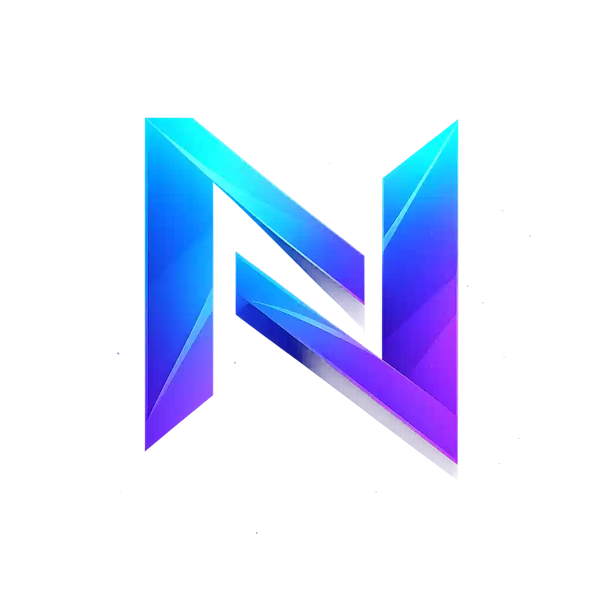
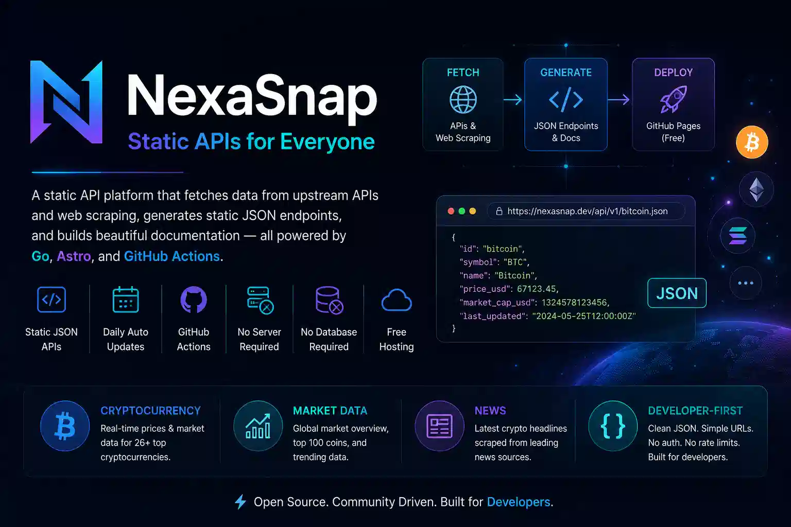

<div style="text-align: center;">
  
  <h1 style="margin: 0;">NEXASNAP</h1>
</div>

> Free Static API Platform — data from CoinGecko, served via GitHub Pages. Updated daily.

[](https://github.com/muhiqsimui/nexasnap/actions/workflows/deploy.yml)

NexaSnap is a **static API platform** that runs entirely on GitHub Pages. A Go generator fetches data from upstream APIs and web scraping, generates static JSON endpoints, and builds an Astro documentation site — all triggered daily via GitHub Actions.

No backend server, no database, no hosting costs.



---

## Architecture

```
┌─────────────────┐     ┌──────────────────┐     ┌─────────────────┐
│   CoinGecko API  │     │  CoinTelegraph   │     │    More APIs    │
│   (REST)         │     │  (Scraping)      │     │    (Future)     │
└────────┬────────┘     └────────┬─────────┘     └────────┬────────┘
         │                       │                        │
         ▼                       ▼                        ▼
┌──────────────────────────────────────────────────────────────┐
│                  Go Generator (generator/)                     │
│  • Fetch → Transform → Write JSON → Generate Docs            │
│  • Triggered by: GitHub Actions (daily 06:00 UTC)            │
└──────────────────────────┬───────────────────────────────────┘
                           │
                           ▼
┌──────────────────────────────────────────────────────────────┐
│                  generated/                                   │
│  • api/v1/*.json        ← Static API endpoints               │
│  • docs/*.json          ← Documentation metadata             │
└──────────────────────────┬───────────────────────────────────┘
                           │
                           ▼
┌──────────────────────────────────────────────────────────────┐
│                  Astro SSG (astro/)                            │
│  • Reads generated/ at build time                             │
│  • Copies API files to public/api/                            │
│  • Generates documentation pages dynamically                  │
│  • Output: static HTML + JSON → dist/                         │
└──────────────────────────┬───────────────────────────────────┘
                           │
                           ▼
┌──────────────────────────────────────────────────────────────┐
│                  GitHub Pages                                  │
│  • Serves everything for free                                 │
│  • Zero server, zero database, zero cost                      │
└──────────────────────────────────────────────────────────────┘
```

## API Endpoints

Base URL: `https://muhiqsimui.github.io/nexasnap/api/v1/`

### Cryptocurrency

| Endpoint                    | Description                  |
| --------------------------- | ---------------------------- |
| `GET /crypto/bitcoin.json`  | Bitcoin price & market data  |
| `GET /crypto/ethereum.json` | Ethereum price & market data |
| `GET /crypto/solana.json`   | Solana price & market data   |
| `GET /crypto/{slug}.json`   | Any of the 26 tracked coins  |

**Tracked coins:** Bitcoin, Ethereum, Tether, XRP, BNB, Solana, USDC, Cardano, Dogecoin, Sui, TRON, Toncoin, Avalanche, Chainlink, POL, Litecoin, Shiba Inu, Bitcoin Cash, Monero, Stellar, Hedera, Cronos, Cosmos, Ethereum Classic, Dai, Filecoin

### Market Data

| Endpoint             | Description                            |
| -------------------- | -------------------------------------- |
| `GET /markets.json`  | Top 100 cryptocurrencies by market cap |
| `GET /global.json`   | Global crypto market overview          |
| `GET /trending.json` | Currently trending coins               |

### News

| Endpoint         | Description                       |
| ---------------- | --------------------------------- |
| `GET /news.json` | Latest crypto headlines (scraped) |

### Response Format

```json
{
  "success": true,
  "source": "CoinGecko",
  "updated": "2026-06-06T06:32:40Z",
  "data": { ... }
}
```

## Project Structure

```
nexasnap/
├── .github/workflows/
│   └── deploy.yml          # GitHub Actions: build + deploy
├── generator/               # Go data generator
│   ├── cmd/main.go          # Entry point
│   ├── internal/
│   │   ├── config/          # API keys, coin definitions
│   │   ├── fetcher/         # CoinGecko API client
│   │   ├── models/          # Data structures
│   │   ├── docs/            # Documentation generator
│   │   ├── scraper/         # Colly web scraper
│   │   └── writer/          # JSON output writer
│   ├── templates/           # Go templates
│   ├── .env                 # Local API keys (gitignored)
│   └── .env.example         # Template for env vars
├── astro/                   # Astro SSG frontend
│   ├── src/
│   │   ├── pages/           # Routes: index, docs, [category]/[slug]
│   │   ├── layouts/         # Base layout with dark theme
│   │   └── lib/             # Utilities: docs loader, URL helper
│   ├── scripts/sync-api.mjs # Copies generated/ → public/api/
│   ├── public/              # Static assets + API files
│   └── astro.config.mjs     # Site config, sitemap
├── generated/               # Generator output (api/ + docs/)
├── Makefile                 # Dev commands
└── README.md
```

## Getting Started

### Prerequisites

- Go 1.22+
- Node.js 22+
- CoinGecko API key (free: https://www.coingecko.com/en/api)

### Setup

```bash
# 1. Clone the repo
git clone https://github.com/muhiqsimui/nexasnap.git
cd nexasnap

# 2. Set up API key
cp generator/.env.example generator/.env
# Edit generator/.env and add your CoinGecko API key

# 3. Install dependencies
cd astro && npm install && cd ..

# 4. Generate API data
make generator

# 5. Sync API files and build
make build

# 6. Preview locally
make dev
```

### Development

```bash
make dev        # Start Astro dev server (localhost:4321)
make generator  # Run Go generator (fetch data → write JSON)
make sync-api   # Copy generated API to Astro public/
make build      # Generator + sync + full Astro build
make clean      # Remove generated JSON files
```

## Deployment

Deployment is fully automated via GitHub Actions.

### How it works

1. **Daily at 06:00 UTC** — the scheduled workflow triggers
2. **Go generator runs** — fetches fresh data from CoinGecko and CoinTelegraph
3. **Astro builds** — generates static HTML pages and copies API JSON files
4. **Deploys to GitHub Pages** — everything goes live

### Manual deploy

Push to `main` or trigger via GitHub Actions UI:

```
Settings → Actions → Deploy NexaSnap → Run workflow
```

### GitHub Secrets Required

| Secret              | Description                 |
| ------------------- | --------------------------- |
| `COINGECKO_API_KEY` | Your CoinGecko demo API key |

Add it at: `Settings → Secrets and variables → Actions → New repository secret`

## Adding New Endpoints

### Add a new coin to track

Edit `generator/internal/config/coins.go`:

```go
{
    CoinGeckoID: "your-coin-id",
    Slug:        "your-slug",
    Name:        "Your Coin Name",
    Symbol:      "YOUR",
    Category:    "crypto",
},
```

### Add a new API source

1. Create a new fetcher in `generator/internal/fetcher/`
2. Add the model in `generator/internal/models/`
3. Wire it up in `generator/cmd/main.go`
4. Add doc generator in `generator/internal/docs/`

## Tech Stack

| Layer           | Technology                   |
| --------------- | ---------------------------- |
| Data Generation | Go, Colly                    |
| Frontend        | Astro, TypeScript            |
| Hosting         | GitHub Pages                 |
| Automation      | GitHub Actions               |
| Data Source     | CoinGecko API, CoinTelegraph |

## License

MIT
